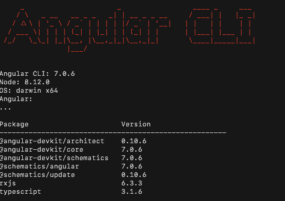

# Angular 
## O que é o Angular?

De acordo com o https://angular.io/docs 

> "O Angular é uma plataforma que facilita a criação de aplicativos para a web. É uma combinação integrada de modelos declarativos, injeção de dependência, ferramentas de ponta a ponta e práticas recomendadas para resolver os desafios de desenvolvimento. Além da Web, o Angular também permite que os desenvolvedores criem aplicativos  para  dispositivos móveis bem como para o desktop." 
### Preparação do ambiente para usar o Angular


#### 1. Instale o servidor Node.js 


::: :walking: Passo a passo :::

**a.** Instale o Node.js para o seu SO : Mac, Linux ou Windows clicando no link https://nodejs.org/en/download/

O Node.js é um `runtime` assíncrono que executa aplicações escritas na linguagem JavaScript e que é  baseado em eventos. 

Foi projetado para criar aplicativos de rede escalonáveis. É uma marca registrada da Joyent, Inc.

Nós iremos usar o Node.js como servidor apenas para executar o nosso exemplo. Em uma aplicação completa usaemos o próprio TomCat como servidor de páginas.

Você poderá instalar o Node, através desta página https://nodejs.org/en/download/

No momento da escrita deste material a última versão estável era: 10.14.1 (incluindo o npm 6.4.1)

#### 2. Instale o TypeScript 

**a.** Para instalar o TypeScript use o seguinte comando no seu prompt:

```
npm install -g typescript
```

A linguagem TypeScript foi criada pela Microsoft, e tem sido uma escolha comum entre os desenvolvedores ASP.NET. Não se trata de uma linguagem completamente nova, na verdade o Typscript é um superconjunto do JavaScript. Sugiro a leitura deste artigo interessantíssimo sobre a evolução do JavaScript https://www.excella.com/insights/typescript-vs-es6-vs-es2015 , vale a pena!

Para se utilizar o Angular, não é obrigatório utilizar a  linguagem Typescript. É possível utilizar o JavaScript, pois o Angular tem uma API do ES5 (usando o JavaScript). Ocorre, entretanto, que  o próprio Angular é escrito em TypeScript e geralmente é o que todos estão usando. Vamos usá-la  porque é uma ótima linguagem e facilita o trabalho com o Angular. 
Fique livre para ler um pouco mais sobre usar o Angular com o Java Script (ES5), veja esse blog https://blog.thoughtram.io/angular/2015/05/09/writing-angular-2-code-in-es5.html que explica como fazer para usar o Angular com o JavaScript ES5.

#### 3. Instale o Angular CLI

```
npm install -g @angular/cli@7.0.6
```
<p align="center">
  
</p>
<p align="center">
   <strong>Figura 1- Imagem do Angular CLI mostrando as versões instaladas</strong> 
</p>

O Angular CLI é um utilitário que permite aos usuários criar e gerenciar projetos, usando apenas o `prompt`. Ele automatiza tarefas como, por exemplo, a criação de projetos completos usando o Angular ou, simplesmente, a adição de novos `controllers` em projetos já existentes. 

Você vai observar que o Angular usa muitos arquivos que devem estar organizados adequadamente em pastas. Por isso é sempre uma boa prática usar o Angular CLI, para que os seus projetos mantenham sempre os mesmos padrões.

#### 4. Verifique a versão do Angular que foi instalada, digitanto `ng --version`


#### 5. Criação da pasta para os projetos `Angular` 


***a.*** Crie uma nova  pasta denominada `Grupo de Estudo\Angular` 

Pronto o ambiente está preparado para começar com o Angular. Siga agora para o primneiro projeto [angular-helo-world].