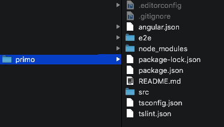

# Angular 
## O que é o Angular?

De acordo com o https://angular.io/docs 

> "O Angular é uma plataforma que facilita a criação de aplicativos para a web. É uma combinação integrada de modelos declarativos, injeção de dependência, ferramentas de ponta a ponta e práticas recomendadas para resolver os desafios de desenvolvimento. Além da Web, o Angular também permite que os desenvolvedores criem aplicativos  para  dispositivos móveis bem como para o desktop." 
### Construindo uma primeira aplicação web usando o Angular

Neste aplicativo simples, abordaremos a maioria dos aspectos essenciais do Angular, incluindo:
- A construção de componentes personalizados;
- A criação de formulários com entrada de dados do usuário;
- A demonstração de renderização de listas de objetos em views;
- Como interceptar os cliques do usuário para tratamento de eventos; e 
- A disponibilização do aplicativo em um servidor.

#### 1. Criando a aplicação primo 


::: :walking: Passo a passo :::

**a.** Instale o Node.js para o seu SO : Mac, Linux ou Windows clicando no link https://nodejs.org/en/download/

O Node.js é um `runtime` assíncrono que executa aplicações escritas na linguagem JavaScript e que é  baseado em eventos. 

Foi projetado para criar aplicativos de rede escalonáveis. É uma marca registrada da Joyent, Inc.

Nós iremos usar o Node.js como servidor apenas para executar o nosso exemplo. Em uma aplicação completa usaemos o próprio TomCat como servidor de páginas.

Você poderá instalar o Node, através desta página https://nodejs.org/en/download/

No momento da escrita deste material a última versão estável era: 10.14.1 (incluindo o npm 6.4.1)

**b**. Instale o TypeScript usando o seguinte comando no seu prompt:

```
npm install -g typescript
```

A linguagem TypeScript foi criada pela Microsoft, e tem sido uma escolha comum entre os desenvolvedores ASP.NET. Não se trata de uma linguagem completamente nova, na verdade o Typscript é um superconjunto do JavaScript. Sugiro a leitura deste artigo interessantíssimo sobre a evolução do JavaScript https://www.excella.com/insights/typescript-vs-es6-vs-es2015 , vale a pena!

Para se utilizar o Angular, não é obrigatório utilizar a  linguagem Typescript. É possível utilizar o JavaScript, pois o Angular tem uma API do ES5 (usando o JavaScript). Ocorre, entretanto, que  o próprio Angular é escrito em TypeScript e geralmente é o que todos estão usando. Vamos usá-la  porque é uma ótima linguagem e facilita o trabalho com o Angular. 
Fique livre para ler um pouco mais sobre usar o Angular com o Java Script (ES5), veja esse blog https://blog.thoughtram.io/angular/2015/05/09/writing-angular-2-code-in-es5.html que explica como fazer para usar o Angular com o JavaScript ES5.

**c**. Instale o Angular CLI

```
npm install -g @angular/cli@7.0.6
```
<p align="center">
  
</p>
<p align="center">
   <strong>Figura 1- Imagem do Angular CLI mostrando as versões instaladas</strong> 
</p>

O Angular CLI é um utilitário que permite aos usuários criar e gerenciar projetos, usando apenas o `prompt`. Ele automatiza tarefas como, por exemplo, a criação de projetos completos usando o Angular ou, simplesmente, a adição de novos `controllers` em projetos já existentes. 

Você vai observar que o Angular usa muitos arquivos que devem estar organizados adequadamente em pastas. Por isso é sempre uma boa prática usar o Angular CLI, para que os seus projetos mantenham sempre os mesmos padrões.

**d.** Verifique a versão do Angular que foi instalada, digitanto `ng --version`


**e.** Crie uma nova  pasta denominada `Grupo de Estudo\Angular` e, nessa pasta, abra um `prompt` e digite o seguinte comando : 

```
ng new primo
```
Veja na Figura 2 o que foi criado pelo Angular CLI

<p align="center">
  
</p>
<p align="center">
   <strong>Figura 2- Estrutura de pastas criada peloi Angula CLI para o projeto ola-mundo</strong> 
</p>

#### 2. Executando a aplicação ola-mundo 

``` java

cd primo
ng serve
** NG Live Development Server is running on http://localhost:4200. **
 //...
 // uma  porção de outras mensagens
 //...
Compiled successfully.

```
#### 3. Alterando a aplicação gerada 

Abra o VSC e edit o arquivo `app.component.html` para o código abaixo:


```html
<div style="text-align:center">
  <h1>
    Olá Mundo! Seja bem-vindo ao {{ title }} Angular 6!
  </h1>
  
</div>
```
No browser digite: 

`localhost:4200`

#### 4. Executando testes unitários usando o Karma

Usando o VSC altere o arquivo `app.component.spec.ts` para o conteúdo do código abaixo:

```TypeScript
import { TestBed, async } from '@angular/core/testing';
import { AppComponent } from './app.component';

describe('AppComponent', () => {
  beforeEach(async(() => {
    TestBed.configureTestingModule({
      declarations: [
        AppComponent
      ],
    }).compileComponents();
  }));

  it('should create the app', () => {
    const fixture = TestBed.createComponent(AppComponent);
    const app = fixture.debugElement.componentInstance;
    expect(app).toBeTruthy();
  });

  it(`should have as title 'primo'`, () => {
    const fixture = TestBed.createComponent(AppComponent);
    const app = fixture.debugElement.componentInstance;
    expect(app.title).toEqual('primo');
  });

  it('should render title in a h1 tag', () => {
    const fixture = TestBed.createComponent(AppComponent);
    fixture.detectChanges();
    const compiled = fixture.debugElement.nativeElement;
    expect(compiled.querySelector('h1').textContent).toContain('Olá Mundo! Seja bem-vindo ao');
  });
});
```
No prompt de comandos, execute

`ng test`

Pronto! Você criou e executou os testes unitários na sua primeira aplicação Angular


