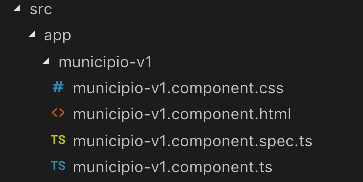

# Angular Forms V1

Os dois objetos fundamentais em formulários no Angular são `FormControl` e `FormGroup`.

## FormControl
Um `FormControl` representa um único campo de entrada - é a menor unidade de um formulário no Angular. FormControls encapsulam o valor do campo e declara que ele é válido, sujo (alterado) ou se contém
erros.


## FormGroup

A maioria dos formulários tem mais de um campo, então precisamos de uma maneira de gerenciar múltiplos `FormControls`. 
Os `FormsGroups` são úteis por agrupar um conjunto de `FormControls`. Por exemplo, se quiséssemos verificar a validade do nosso formulário, teríamo que fazer uma iteração em uma `array` de `FormControls` e verificar se foram violadas as regras de interface em cada um deles . Os `FormGroups` entram em cena exatamente para resolver esse tipo de problema pois representam uma coleção de `FormControls`.

### Criando uma aplicação com um primeiro formulário

::: :walking: Passo a passo :::  

1. Na pasta `Grupo de Estudo\Angular` abra um `prompt`e digite

```java
ng new angular-forms
```
Após criada a aplicação faça:

```java
 cd angular-forms
 ng generate component municipioV1 
```
> `ng` é um prefixo que significa `Angular` e está invocando o Anglular-Cli para gerar um novo componente. Vide Figura 1.

<p align="center">
  
</p>
<p align="center">
   <strong>Figura 1- Arquivos após gerar municipioV1</strong> 
</p>

2. Alterar o módulo da aplicação

### O que são os NgModule

> Uma aplicação Angular é por natureza dividida em módulos. Os módulos são descritos (o que contém, o que importam e o que exportam) através da utilização do NgModule 
Um NgModule é, na verdade uma anotação `decorator` que marca uma determinada classe com a anotação @NgModule. @NgModule  descreve como compilar um componente e como injetar um determinado serviço em tempo de execução. Ele identifica os componentes, diretivas e filtros do próprio módulo, tornando alguns deles públicos, por meio da propriedade `exports`, para que componentes externos possam usá-los. O @NgModule também pode adicionar provedores de serviços para que o Angular faça a injeção de dependência nos componentes apropriados.

