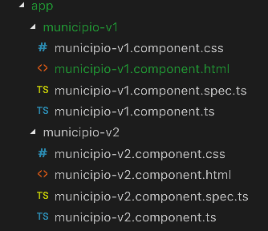

# Angular Forms V2

Nesta versão vamos implementar validadores nos campos do formulário.

### Criando uma aplicação com um segundo formulário

::: :walking: Passo a passo :::  

1. Na pasta `Grupo de Estudo\Angular` abra um `prompt`e digite


```java
 cd angular-forms
 ng generate component municipioV2 
```

> Observe que após a execução da instrução acima, foram criados novos arquivos pelo Angular-Cli, vide Figura 1.

<p align="center">
  
</p>
<p align="center">
   <strong>Figura 1- Arquivos após gerar municipioV2</strong> 
</p>

2. Alterar o componente  `MunicipioV2Component`, conforme Listagem 1.

```typescript
iimport { Component, OnInit } from '@angular/core';

@Component({
  selector: 'app-municipio-v2',
  templateUrl: './municipio-v2.component.html',
  styleUrls: ['./municipio-v2.component.css']
})
export class MunicipioV2Component implements OnInit {
  nomeMunicipio: string ;//<<< criada a variável de instância nomeMunicipio
  uf: string; //<<< criada a variável de instância uf
  constructor() { }

  ngOnInit() {
  }
 //Criado o método salvar
  save(): void {
    console.log ('O nome do municipio é', this.nomeMunicipio); //<<< usando this.
    console.log ('O estado é', this.uf); //<<< usando this.

  }
}
}
````

<p align="center">
   <strong>Listagem 1- Componente MunicipioV2Component</strong> 
</p>

2. Alterar o arquivo  `municipio-v2.component.html`, conforme Listagem 2.

```html
<div class="row justify-content-center">
    <h2 class="ui header">Cadastro de Município V2</h2>
  <div class="col-8">
    <form name="editForm" novalidate (ngSubmit)="save()" class="ui form" #editForm="ngForm">
      <div class="form-group">
        <label class="form-control-label" for="nomeMunicipio">Nome do Município:</label>
        <input class="form-control" type="text" id="nomeMunicipio" placeholder="Nome do Municipio" name="nomeMunicipio"
          [(ngModel)]="nomeMunicipio" required minlength="3" maxlength="50">
        <div [hidden]="!(editForm.controls.nomeMunicipio?.dirty && editForm.controls.nomeMunicipio?.invalid)">
          <small class="form-text text-danger" [hidden]="!editForm.controls.nomeMunicipio?.errors?.required">
            O nome do município é obrigatório.
          </small>
          <small class="ui error message" [hidden]="!(editForm.controls.nomeMunicipio?.dirty && editForm.controls.nomeMunicipio?.invalid)">
            Nome do município deve ter entre 3 e 50 caracteres.
          </small>
        </div>
      </div>
      <div class="form-group">
        <label class="form-control-label" for="uf">Estado:</label>
        <input class="form-control" type="text" id="uf" placeholder="UF" name="uf" [(ngModel)]="uf" required>
        <div [hidden]="!(editForm.controls.uf?.dirty && editForm.controls.uf?.invalid)">
          <small class="form-text text-danger" [hidden]="!editForm.controls.uf?.errors?.required">
            UF é obrigatória.
          </small>
        </div>
      </div>
      <div>
        <button type="submit" class="ui button">Gravar</button>
      </div>
    </form>
  </div>
</div>

```
<p align="center">
   <strong>Listagem 2- Camada View da aplicação: arquivo municipio-v2.component.html</strong> 
</p>

::: :pushpin: Importante :::

> Vamos comentar as instruções mais importantes dessa listagem

```
    <form name="editForm" novalidate (ngSubmit)="save()" class="ui form" #editForm="ngForm">

```

> Quando se importa `FormsModule` a tag `form` é automaticamente ligada às diretivas `ngForm`, `ngModel`, `ngSubmit` dentre outas. 

#### ngForm
> A diretiva `ngForm` cria uma instância de `FormGroup` e a vincula a um formulário para rastrear os valores dos `FormControls` agrupados. Permite acesso também ao status de validação, tal como `dirty`, `valid`, `touched`, `value` etc.

#### #editForm="ngForm"
> Opcionalmente a diretiva pode ser associada a uma variável de modelo local usando a chave `#` (ex: #myForm = "ngForm"). Apesar de opcional essa técnica é bastante útil pois muitas propriedades da instância do `FormGroup`  podem ser usadas como propriedades de interação do usuário, como `editForm.controls.uf?.dirty`.

#### (ngSubmit)="save()"
> `(ngSubmit)` é uma diretiva de `output`, ou seja, faz  a ligação **saindo** da `view` para um método do `controller`. No caso em estudo está vinculando o  `submit` do formulário ao método `save()` do componente. 

#### novalidate


