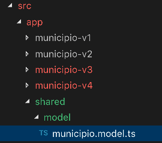

# Angular Forms V4

Na  versão (V4) vamos fazer a ligação com uma classe de dados `Municipio`.
O objetivo desta versão é a criação de uma classe Municipio para quando o formulário for submetido, seja criada uma instância dessa classe no formato JSON.

### Criando uma aplicação com um segundo formulário

::: :walking: Passo a passo :::  

1. Na pasta `Grupo de Estudo\Angular` abra um `prompt`e digite


```java
 cd angular-forms
 ng generate component municipioV4 
```


2. Alterar o componente  `MunicipioV4Component`, conforme Listagem 1.

```typescript
import { Component, OnInit } from '@angular/core';
import { IMunicipio, Municipio, Estado } from '../shared/model/municipio.model'; //<<< alterado aqui

@Component({
  selector: 'app-municipio-v4',
  templateUrl: './municipio-v4.component.html',
  styleUrls: ['./municipio-v4.component.css']
})
export class MunicipioV4Component implements OnInit {
  municipio: IMunicipio = new Municipio(); //<<< alterado aqui

   constructor() { }

  ngOnInit() {
  }

  save(): void {
    console.log ('O municipio é', this.municipio); //<<< alterado aqui

  }
}


````

<p align="center">
   <strong>Listagem 1- Componente MunicipioV4Component</strong> 
</p>

2. Alterar o arquivo  `app.component.html`.


Substitua as instruções da página por `<app-municipio-v4></app-municipio-v4>`. 

3. Crie a estrutura de pastas da Figura 1 e em seguida o arquivo `municipio.model.ts` conforme Listagem 1.


<p align="center">
  
</p>

<p align="center">
   <strong>Figura 1- Estrutura de pastas para o modelo de dados</strong> 
</p>


```typescript 

export const enum Estado {
    MT = 'MT',
    SP = 'SP',
    RJ = 'RJ',
    RS = 'RS',
    RN = 'RN',
    GO = 'GO',
    SC = 'SC',
    MA = 'MA',
    TO = 'TO',
    AM = 'AM',
    PA = 'PA',
    PR = 'PR',
    MG = 'MG',
    BA = 'BA',
    SE = 'SE',
    AL = 'AL',
    RR = 'RR',
    RO = 'RO',
    AC = 'AC',
    PI = 'PI',
    PE = 'PE',
    CE = 'CE'
}

export interface IMunicipio {
    id?: number;
    nomeMunicipio?: string;
    uf?: Estado;
}

export class Municipio implements IMunicipio {
    constructor(public id?: number, public nomeMunicipio?: string, public uf?: Estado) {}
}

```

<p align="center">
   <strong>Listagem 1- Modelo de dados : arquivo municipiomodel.ts</strong> 
</p>

4. Alterar o arquivo  `municipio-v4.component.html`, conforme Listagem 2.

```html
<div class="container">

    <h2>Formulário de Entrada de Dados<small>Municípios</small></h2>
  
  
    <form name="editForm" novalidate (ngSubmit)="save()" #editForm="ngForm">
      <div class="group">
        <input type="text" id="nomeMunicipio" name="nomeMunicipio" [(ngModel)]="municipio.nomeMunicipio" required minlength="3"
          maxlength="50">
        <div [hidden]="!(editForm.controls.nomeMunicipio?.dirty && editForm.controls.nomeMunicipio?.invalid)">
          <small class="form-text text-danger" [hidden]="!editForm.controls.nomeMunicipio?.errors?.required">
            Campo obrigatório.
          </small>
          <small class="ui error message" [hidden]="!(editForm.controls.nomeMunicipio?.dirty && editForm.controls.nomeMunicipio?.invalid)">
            Deve ter entre 3 e 50 caracteres.
          </small>
        </div> <span class="highlight"></span>
        <span class="bar"></span>
        <label for="nomeMunicipio">Nome do Município:</label>
      </div>
  
      <div class="select">
        <select class="select-text" name="uf" [(ngModel)]="municipio.uf" id="field_uf" required>
          <option [ngValue]="selecione">Selecione</option>
          <option value="MT">MT</option>
          <option value="SP">SP</option>
          <option value="RJ">RJ</option>
          <option value="RS">RS</option>
          <option value="RN">RN</option>
          <option value="GO">GO</option>
          <option value="SC">SC</option>
          <option value="MA">MA</option>
          <option value="TO">TO</option>
          <option value="AM">AM</option>
          <option value="PA">PA</option>
          <option value="PR">PR</option>
          <option value="MG">MG</option>
          <option value="BA">BA</option>
          <option value="SE">SE</option>
          <option value="AL">AL</option>
          <option value="RR">RR</option>
          <option value="RO">RO</option>
          <option value="AC">AC</option>
          <option value="PI">PI</option>
          <option value="PE">PE</option>
          <option value="CE">CE</option>
        </select>
        <div [hidden]="!(editForm.controls.uf?.dirty && editForm.controls.uf?.invalid)">
          <small class="form-text text-danger" [hidden]="!editForm.controls.uf?.errors?.required">
            Selecione uma UF obrigatoriamente.
          </small>
        </div>
        <span class="select-highlight"></span>
        <span class="select-bar"></span>
        <label class="select-label" for="uf">Estado:</label>
      </div>
      <div class="buttons">
        <div [hidden]="editForm.form.invalid ">
          <button type="submit" class="button">Gravar</button>
        </div>
        <div [hidden]="!editForm.form.invalid ">
          <button disabled class="button disabled">Gravar</button>
        </div>
      </div>
    </form>
  </div>
  
```
<p align="center">
   <strong>Listagem 2- Camada View da aplicação: arquivo municipio-v4.component.html</strong> 
</p>

::: :pushpin: Importante :::

> Observe as alterações no arquivo :

```html
  <input type="text" id="nomeMunicipio" ... [(ngModel)]="municipio.nomeMunicipio" <<< Alterado aqui 
```

```html
        <select class="select-text" ... [(ngModel)]="municipio.uf" <<< Alterado aqui
```

> Essas mudanças forma necessárias porque nesta versão o `[(ngModel)]` está sendo associado aos atributos (nomeMunicipio e uf) da instância da classe Municipio.


#### Desafio 1 :innocent: 
 
- Exexcute o comando `ng serve` e digite no seu browser a url  `localhost:4200`. 
Abra a console do navegador, usando as instruções abaixo e clique no botão `Salvar`.

> Foi instanciada a classe Município em formato JSON?


Pronto, nesta  versão vamos fizemos a ligação com uma classe de dados `Municipio`
criando a classe Municipio para quando o formulário for submetido, seja criada uma instância dessa classe no formato JSON. Na próxima versão [V5](README.V5.md)  vamos criar uma classe de serviços.
