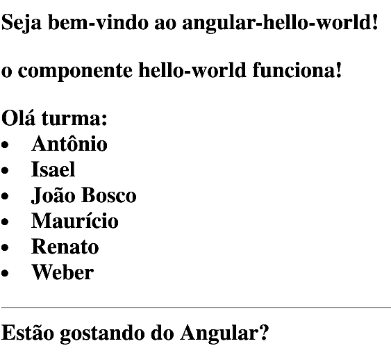

# Angular Hello World 

##  Construindo uma primeira aplicação web usando o Angular

Neste aplicativo simples, abordaremos a maioria dos aspectos essenciais do Angular, incluindo:
- A construção de componentes personalizados;
- A criação de formulários com entrada de dados do usuário;
- A demonstração de renderização de listas de objetos em views;
- Como interceptar os cliques do usuário para tratamento de eventos; e 
- A disponibilização do aplicativo em um servidor.

### 1. Construção do primeiro componente personalizado 

::: :mortar_board: Novo conceito :::

Primeiramente vamos definir o que vem a ser um **componente** para o Angular

A linguagem HTML tem um conjunto limitado de tags: por exemplo `<h1>`, `<div>`, `<image>` etc. Os browsers estão preparados para renderizar esse conjunto de tags.
Não seria interessante se pudéssemos criar novas tags com um conjunto de funcionalidades pré-programadas?

Essa é a idéia por traz dos componentes : criar novas tags que conteriam  blocos de código que irão ser renderizados pelos browsers e apresentados ao usuário.
Então vamos mostrar como se cria um novo componente Angular.

::: :walking: Passo a passo :::


**a.** Na pasta `Angular`, digite o seguinte comando no prompt: 

```
ng new angular-hello-world
```

Faça `cd angular-hello-world`

Nosso primeiro componente se chamará `<app-hello-world></app-hello-world>`.
Como você pode observar os componentes são tags e usam o símbolo `<>`.
Esse nosso primeiro componente não fará muitra coisa, irá apenas exibir uma mensagem de saudação.

A maneira mais simples de criar componentes Angular é usar a própria ferramenta fornecida com o Angular CLI.

**b.** Para criar o componente, digite o seguinte comando no prompt: 

```
ng generate component app-hello-world
```
O Angular CLI irá criar uma pasta denominada `hello-world` contendo 4 arquivos:
- hello-world.component.css
- hello-world.component.html
- hello-world.component.spec.ts
- hello-world.component.ts

Vamos explicar detalhadamente cada um dos arquivos:

O arquivo `hello-world.component.css` define um estilo que pode ser utilizado para renderizar o componente. Para saber mais sobre css  [clique aqui](https://www.w3schools.com/css/css_intro.asp).

O arquivo `hello-world.component.html` define na linguagem html, o que será exibido para o usuário.

O arquivo `hello-world.component.spec.ts` é o teste unitário para esse componente, usando o Karma. Para saber mais sobre o Karma clique [aqui](https://karma-runner.github.io/latest/index.html)

O arquivo `hello-world.component.ts` é o código TypeScript que está por trás do nosso componente.

```javascript 
import { Component, OnInit } from '@angular/core';

@Component({
  selector: 'app-hello-world',
  templateUrl: './hello-world.component.html',
  styleUrls: ['./hello-world.component.css']
})
export class HelloWorldComponent implements OnInit {

  constructor() { }

  ngOnInit() {
  }

}
```
::: :pushpin: Importante :::

> Observe a anotação
```javascript
@Component({
  selector: 'app-hello-world',
  templateUrl: './hello-world.component.html',
  styleUrls: ['./hello-world.component.css']
})
```

O primeiro parâmetro `selector: 'app-hello-world'` informa qual a tag que está associada a este componente. Isso significa que o componente deverá ser usado como `<app-hello-world></app-heloo-world>`

O segundo parâmetro informa qual o template em html que será utilizado. E o terceiro o estilo (arquivo css) associado.

Mais abaixo no arquivo `hello-world.component.ts`, temos uma declaração de que trata-se de uma classe que implementa a interface OnInit: `export class HelloWorldComponent implements OnInit`

**c.** No VSC  edite o arquivo `hello-world.component.html` conforme Listagem 1

```html
<p>
  o componente hello-world funciona!
</p>
```
<p align="center">
   <strong>Listagem 1- Template hello-world.component.html</strong> 
</p>

**d.** No VSC  edite o arquivo `app.component.html` conforme Listagem 2


```html
<div style="text-align:left">
  <h1>
    Seja bem-vindo ao {{ title }}! 
    <app-hello-world></app-hello-world>
   </h1>
</div>
```
<p align="center">
   <strong>Listagem 2- Template app.component.html</strong> 
</p>


**e.** Executando a aplicação  

No prompt de comandos, na pasta `Angular/angular-hello-world`,  digite:
```
ng serve 
```
 
> Este comando inicia o Node.js e disponibiliza a aplicação na porta 4200 por padrão. No navegador digite o seguinte endereço:

```
http://localhost:4200
```
### 2. Construção do segundo componente personalizado 

Agora vamos construir um componente um pouco mais útil. Esse nosso componente será capaz de utilizar nomes de pessoas que estejam em uma lista e apresentá-los em uma página html.

::: :walking: Passo a passo :::


**a.** Para criar o novo componente, digite o seguinte comando no prompt: 

```
ng generate component user-item
```
O Angular CLI irá criar uma pasta denominada `user-item` contendo 4 arquivos:
- user-item.component.css
- user-item.component.html
- user-item.component.spec.ts
- user-item.component.ts

**b.** No VSC  edite o arquivo `user-item.component.ts` com o código TypeScript a ser executado no nosso componente.

```javascript 
import { Component, OnInit } from '@angular/core';

@Component({
  selector: 'app-user-item',
  templateUrl: './user-item.component.html',
  styleUrls: ['./user-item.component.css']
})
export class UserItemComponent implements OnInit {
  nomes: string[];
  constructor() {
    this.nomes = ['Antônio', 'Isael', 'João Bosco', 'Mauricio', 'Renato', 'Weber']; // nome dos componentes do Grupo ABIM
  }

  ngOnInit() {
  }

}

```

<p align="center">
   <strong>Listagem 3- user-item.component.ts</strong> 
</p>

::: :pushpin: Importante :::

> Observe a instrução:
```typescript
 1 nomes: string[];
 2 constructor() {
 3   this.nomes = ['Antônio', 'Isael', 'João Bosco', 'Mauricio', 'Renato', 'Weber']; // nome dos componentes do Grupo ABIM
  }
```

Em (1) a variável `nomes` está sendo declarada como sendo um `array de strings`. Em (2) temos a declaração do método construtor da classe `UserItemComponente`. E, em (3), a atribuição de valores para a variável `nomes` .


**c.** No VSC  edite o arquivo `user-item.component.html` conforme Listagem 4

```html
<p>
  Olá turma:
  <li *ngFor = "let nome of nomes">{{ nome }}</li>
</p>
<hr>
Estão gostando do Angular?```
```
<p align="center">
   <strong>Listagem 4- Template hello-world.component.html</strong> 
</p>

::: :pushpin: Importante :::

> Observe a instrução:

```html
<p>
  Olá turma:
1  <li *ngFor = "let nome of nomes">{{ nome }}</li>
</p>
<hr>
Estão gostando do Angular?```
```
> A linha mais importante é a (1). Essa linha faz um loop usando o `*ngFor` atribuindo à  variável `nome` os valores do `array` `nomes` em cada uma das interações. Em seguida a variável `nome` é exibida usando-se a instrução `{{nome}}`.

 
**d.** No VSC  edite o arquivo `app.component.html` conforme Listagem 5


```html
<div style="text-align:left">
  <h1>
    Seja bem-vindo ao {{ title }}! 
    <app-hello-world></app-hello-world>
    <app-user-item></app-user-item>
 </h1>
</div>
```
<p align="center">
   <strong>Listagem 5- Template app.component.html com o novo componente</strong> 
</p>
```


**e.** Executando a aplicação  

No prompt de comandos, na pasta Angular/angular-hello-world,  digite:
```
ng serve 
```
 
No navegador digite o endereço

```
http://localhost:4200

<p align="center">
  
</p>
<p align="center">
   <strong>Figura 1- Imagem da aplicação sendo executada</strong> 
</p>